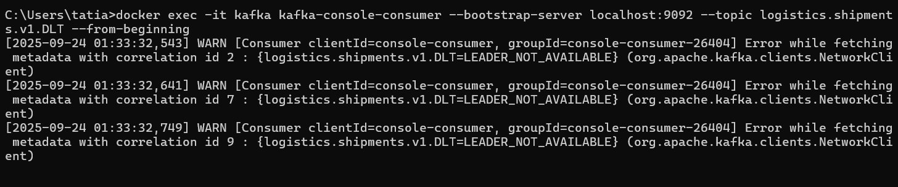
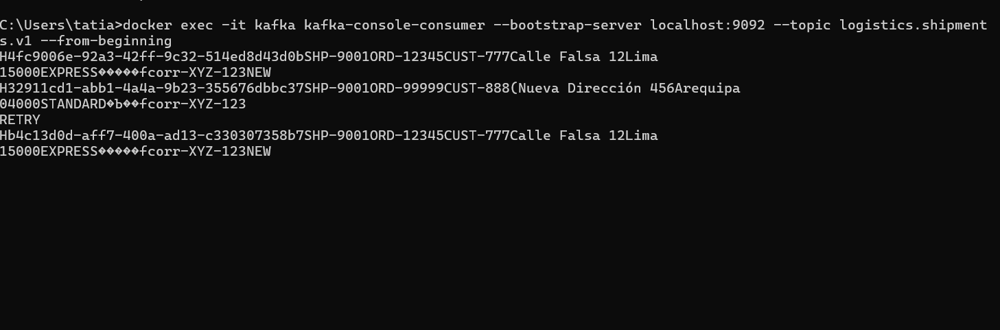
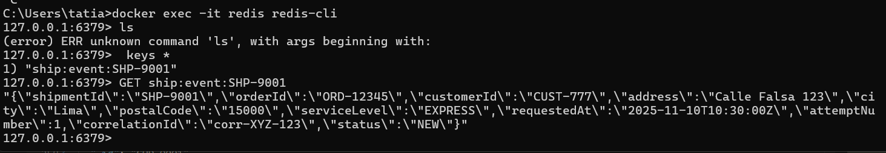
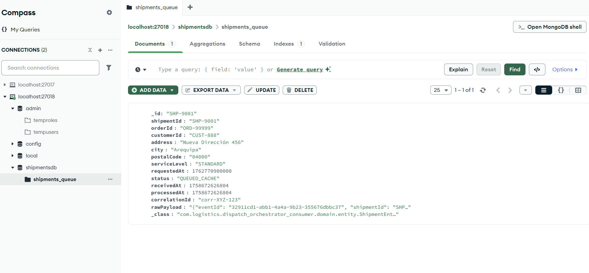
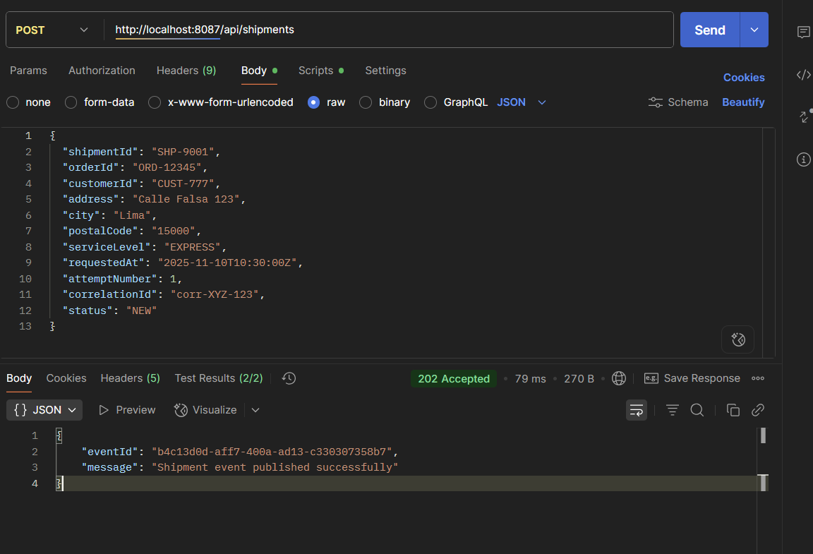
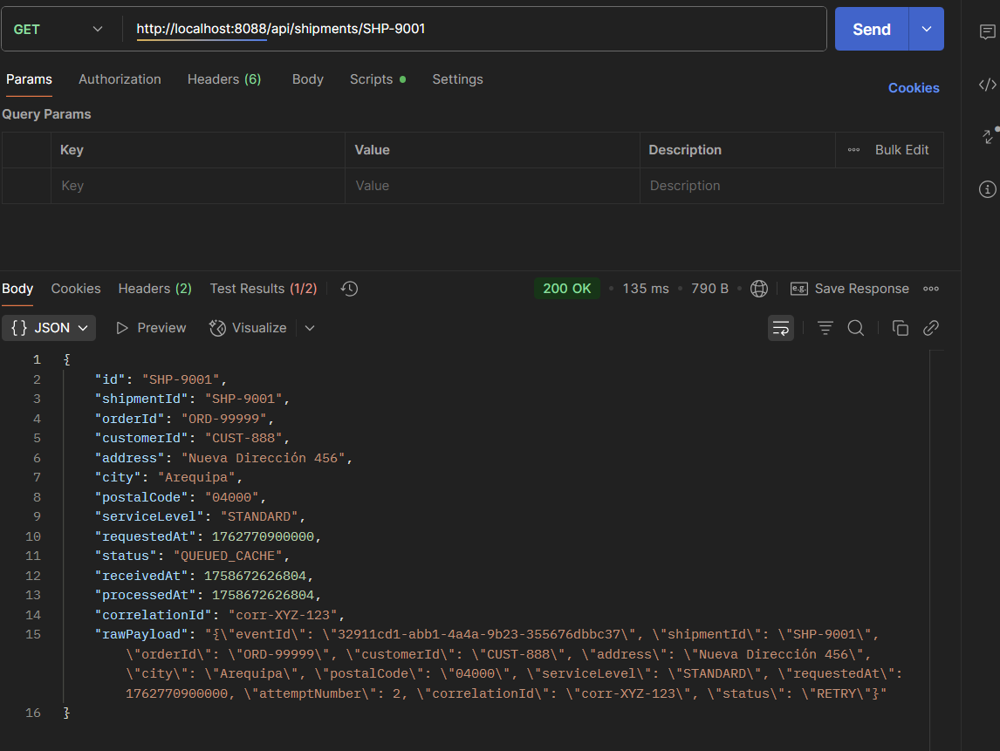

# Orquestación de Entregas Express

Flujo EDA (Event-Driven Architecture) para gestionar entregas con arquitectura de microservicios usando Spring Boot, Kafka, Redis y MongoDB.

## Componentes

**shipping-ops-producer** `:8087`
- Recibe pedidos de envío vía REST API
- Publica eventos Avro a Kafka (topic: `logistics.shipments.v1`)
- Guarda snapshots en Redis con TTL 4 horas (key: `ship:event:{shipmentId}`)

**dispatch-orchestrator-consumer** `:8088`
- Consume eventos de Kafka automáticamente
- Aplica reglas de idempotencia y segundo intento desde cache
- Persiste en MongoDB con estados QUEUED/QUEUED_CACHE
- Expone endpoints de consulta y observabilidad

**Infraestructura**
- Zookeeper + Kafka + Schema Registry
- Redis (snapshots con TTL)
- MongoDB (puerto 27018, colección: shipments_queue)
- Dead Letter Topic para errores

## Cómo levantar todo

**Requisitos previos**
- Docker Desktop
- Puertos libres: 8087, 8088, 2181, 9092, 8081, 6379, 27018

**Inicialización**
```bash
docker compose up --build -d
docker compose ps  
```

**Health Checks**
```bash
curl -i http://localhost:8087/actuator/health  # producer
curl -i http://localhost:8088/api/health       # consumer
```

## Endpoints de prueba

### 1. Intento 1 (Primer envío)
```bash
curl -s -X POST http://localhost:8087/api/shipments \
  -H "Content-Type: application/json" \
  -d '{
    "shipmentId":"SHP-9001","orderId":"ORD-12345","customerId":"CUST-777",
    "address":"Calle Falsa 123","city":"Lima","postalCode":"15000",
    "serviceLevel":"EXPRESS","requestedAt":"2025-11-10T10:30:00Z",
    "attemptNumber":1,"correlationId":"corr-XYZ-123","status":"NEW"
  }'
```

### 2. Consulta en el consumer
```bash
curl -s http://localhost:8088/api/shipments/SHP-9001 | jq .
```

### 3. Intento 2 (Segundo intento desde cache)
```bash
curl -s -X POST http://localhost:8087/api/shipments \
  -H "Content-Type: application/json" \
  -d '{
    "shipmentId":"SHP-9001","orderId":"ORD-12345","customerId":"CUST-777",
    "address":"Calle Falsa 123","city":"Lima","postalCode":"15000",
    "serviceLevel":"EXPRESS","requestedAt":"2025-11-10T10:35:00Z",
    "attemptNumber":2,"correlationId":"corr-XYZ-123","status":"RETRY"
  }'
```

### 4. Health Check
```bash
curl -i http://localhost:8088/api/health
```

### 5. Duplicado (repetir intento 1)
```bash
# Ejecutar nuevamente el comando del paso 1
# Resultado: ACK duplicado, no recalza ni duplica
```

### 6. Error controlado (sin shipmentId)
```bash
curl -s -X POST http://localhost:8087/api/shipments \
  -H "Content-Type: application/json" \
  -d '{
    "orderId":"ORD-ERROR","customerId":"CUST-999",
    "attemptNumber":1,"status":"NEW"
  }'
# Resultado: Consumer envía al DLT logistics.shipments.v1.DLT
```

## Evidencias

### Capturas de Kafka
**Mensaje en topic principal logistics.shipments.v1:**



**Mensaje en DLT logistics.shipments.v1.DLT:**



### Capturas de Redis



### Capturas de MongoDB



### Respuestas de los endpoints






